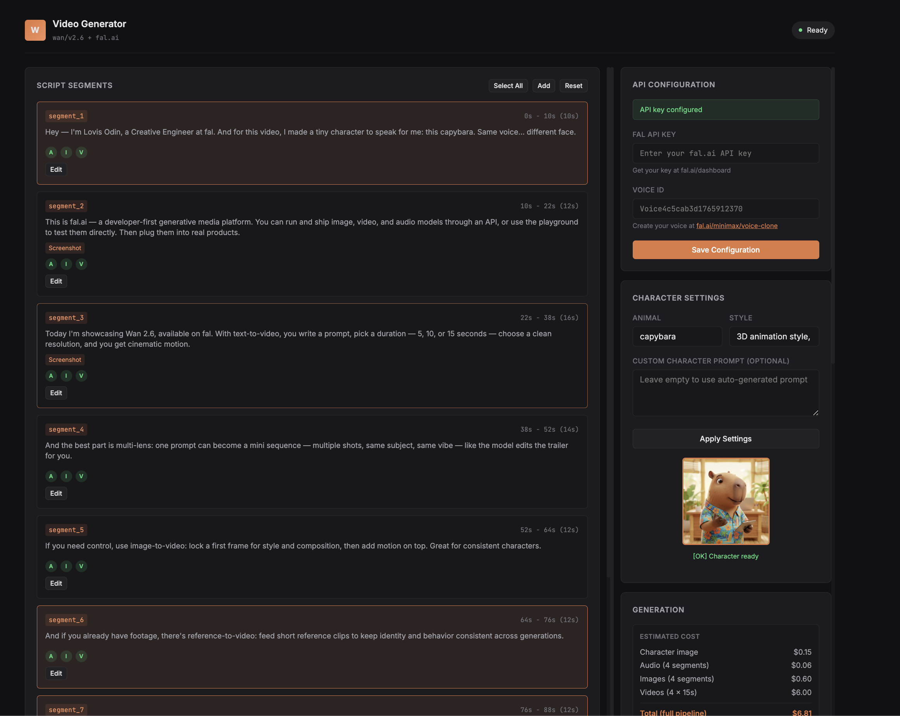

# Wan 2.6 Video Generation Pipeline



Built for the **official Wan 2.6 release by Alibaba**. An automated pipeline that chains fal.ai APIs to generate videos from script segments.

**Stack:** MiniMax Speech-02 HD → Nano Banana Pro → Wan 2.6 (lip-sync)

## Features

- **Full Automation** - Generate complete videos from script to final output
- **Custom Voice** - Uses MiniMax voice ID with emotion control
- **Character Consistency** - Generates reference images for visual continuity
- **Audio-Driven Video** - Syncs video generation with generated speech
- **Web Interface** - Clean UI to control and preview the pipeline
- **Modular Design** - Run individual steps or the full pipeline
- **Fully Configurable** - Edit segments, prompts, and settings directly in the browser

## Quick Start

### 1. Install Dependencies

```bash
pip install -r requirements.txt
```

### 2. Run the Application

```bash
python app.py
```

### 3. Configure API Keys

Open http://localhost:5000 in your browser and enter your API keys in the **API Configuration** panel:

- **FAL API Key** - Get yours at [fal.ai/dashboard](https://fal.ai/dashboard)
- **Voice ID** - Your MiniMax voice ID (default provided)

Your keys are stored in your browser's localStorage and sent to the server when needed.

### 4. Generate Videos

1. Configure your character (animal type, style, or custom prompt)
2. Generate the main character image
3. Edit script segments as needed (text, visual prompts, timing)
4. Click "Generate All" to run the full pipeline

## Configuration

All settings can be configured directly in the web interface:

### Character Settings
- **Animal Type** - The character animal (capybara, penguin, fox, etc.)
- **Style** - Visual style (3D animation, Ghibli, cartoon, etc.)
- **Custom Prompt** - Override the auto-generated character prompt

### Script Segments
Each segment includes:
- **Script Text** - The spoken narration
- **Visual Prompt** - Description for image/video generation
- **Timing** - Start and end times in seconds
- **Screenshot URLs** - Optional URLs for automatic screenshot composites

## API Endpoints

| Endpoint | Method | Description |
|----------|--------|-------------|
| `/api/config/keys` | GET/POST | Get or set API keys |
| `/api/segments` | GET | Get all script segments |
| `/api/segments` | POST | Add a new segment |
| `/api/segments/<id>` | PUT | Update a segment |
| `/api/segments/<id>` | DELETE | Delete a segment |
| `/api/segments/reset` | POST | Reset to default template |
| `/api/generate/character` | POST | Generate main character |
| `/api/generate/full` | POST | Run full pipeline |
| `/api/status` | GET | Get current generation status |

## Output Structure

```
output/
├── audio/
│   ├── segment_1_speech.mp3
│   └── ...
├── images/
│   ├── main_character_reference.png
│   ├── segment_1_character.png
│   └── ...
├── videos/
│   ├── segment_1_video.mp4
│   └── ...
├── screenshots/
├── composites/
└── progress.json
```

## Tech Stack

- **Python 3.11+**
- **Flask** - Web framework
- **fal-client** - fal.ai API client
- **pydub** - Audio processing
- **playwright** - Automatic screenshots

## Models Used

- **MiniMax Speech-02 HD** - Voice synthesis
- **Nano Banana Pro** - Image generation
- **Wan 2.6** - Video generation with lip-sync

## License

MIT

## Links

- [fal.ai Documentation](https://docs.fal.ai)
- [Wan 2.6 on fal](https://fal.ai/models/wan/v2.6/text-to-video)


